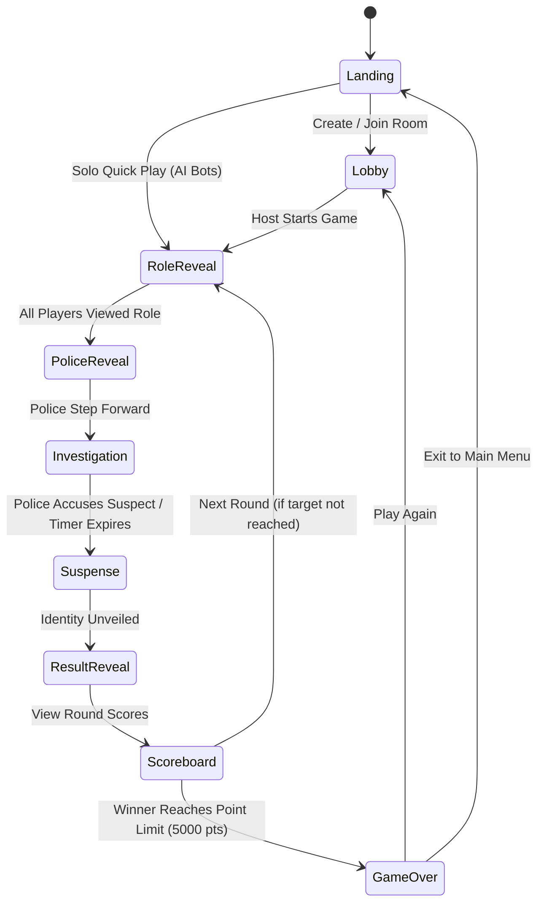

# 👑 Raja Rani (राजा रानी)

> **Trust Nobody.** A modern, multiplayer web game based on the traditional Nepali social deduction party game.

---

## 📖 About the Game

**Raja Rani** is a popular traditional party game played in Nepal and South Asia. Courtiers are dealt confidential roles, but only the **Police** publicly reveals their identity. The Police must interrogate the court and determine who the **Chor (Thief)** is.

### 🎭 Roles & Royal Bounty

| Role | Points | Visibility | Action |
| :--- | :--- | :--- | :--- |
| 👑 **Raja (King)** | 2000 | 🔒 Secret | Supreme ruler. Collects full royal bounty. |
| 👸 **Rani (Queen)** | 1500 | 🔒 Secret | Royal dignity. Remains hidden. |
| 🧠 **Mantri (Minister)** | 1000 | 🔒 Secret | Shrewd advisor. Observes in secret. |
| 👮 **Police (Kotwal)** | 500 (or 0) | 📢 **Public Reveal** | **The only public role.** Must investigate and accuse the Chor. |
| 🥷 **Chor (Thief)** | 0 (or +500) | 🔒 Secret | Bluffs innocence. If Police guesses wrong, Chor steals the 500 points! |

### ⚖️ Investigation & Scoring
- **Police guesses Chor correctly**: Police gets **+500 pts**, Chor gets **0 pts**.
- **Police guesses wrong**: Police gets **0 pts**, Chor gets **+500 pts**.
- Court members (Raja, Rani, Mantri) always receive their full role points.

---

## 🎮 How to Play (4 Simple Steps)

1. **🏰 Create or Join a Room**: Start a game with 4-5 players locally or play solo against smart AI bots.
2. **🎴 Secret Role Distribution**: Flip your confidential royal 3D card to view your assigned title.
3. **👮 Public Kotwal Announcement**: Kotwal (Police) is announced to all players. The remaining courtiers keep their identities concealed.
4. **🕵️ Interrogation & Final Judgment**: Kotwal interrogates players, listens to bluffs, and accuses the suspected Chor before the timer expires!

---

## ✨ Features

- 🎨 **Dual Luxury Themes**: Royal Ivory (warm cream, imperial blue & rich gold) and Midnight Onyx Dark Mode with smooth instant switching.
- 🎴 **3D Flip Role Cards**: Realistic spring-based 3D physics for confidential role reveal with anti-peeking privacy shields.
- 🔒 **Zero Role Leaking**: Active roles remain strictly hidden on client side.
- 🔊 **Built-in Web Audio Synthesizer**: Procedural sound effects (card shuffle, 3D flip, police fanfare, suspense heartbeat, timer ticks, victory chimes, buzzer) with zero external audio assets.
- 🤖 **Smart AI Bot Mode**: Play solo against 4 intelligent AI bots with realistic bluffing dialogues and investigation AI.
- 🌐 **Real-time Local / Multi-Tab Multiplayer**: Room code generation and instant tab synchronization using `BroadcastChannel` and `localStorage`.
- 🏆 **Dynamic Leaderboard**: Round-by-round point breakdown, animated score counters, and cinematic victory crowning ceremony with confetti celebration.
- ⌨️ **Accessible Keyboard Controls**: Full keyboard navigation support with shortcuts for speed and accessibility.

---

## ⌨️ Keyboard Shortcuts

| Shortcut | Action |
| :--- | :--- |
| <kbd>M</kbd> | Toggle sound mute / unmute globally |
| <kbd>Esc</kbd> | Close rules modal or accusation prompt |
| <kbd>1</kbd> – <kbd>5</kbd> | Select suspect player card during Police investigation |
| <kbd>Enter</kbd> / <kbd>Space</kbd> | Confirm selection or trigger button actions |

---

## 🚀 Getting Started

### Prerequisites
- [Node.js](https://nodejs.org/) (v18 or higher)
- npm or yarn

### Installation
```bash
# Clone the repository
git clone https://github.com/sanskarr-py/Raja-Rani.git

# Navigate to project directory
cd Raja-Rani

# Install dependencies
npm install

# Start development server
npm run dev
```

Open [http://localhost:5173](http://localhost:5173) in your browser.

### Available Scripts

| Command | Description |
| :--- | :--- |
| `npm run dev` | Starts Vite local development server |
| `npm run build` | Typechecks with TypeScript and creates production build |
| `npm run lint` | Runs oxlint fast code linter across the project |
| `npm run preview` | Locally previews production build |

---

## 🛠️ Built With

- **React 19** + **TypeScript**
- **Vite**
- **Tailwind CSS**
- **Framer Motion**
- **Canvas Confetti**
- **Lucide Icons**
- **Web Audio API**

---

## 🏗️ Architecture & State Machine



---

## 📁 Project Structure

```text
Raja-Rani/
├── public/               # Static web assets & favicon
├── src/
│   ├── assets/           # Application icons and branding
│   ├── components/
│   │   ├── common/       # Navbar, Button, RulesModal, ParticleBackground
│   │   ├── landing/      # LandingPage, CreateRoom, JoinRoom
│   │   ├── lobby/        # LobbyView, player roster, room management
│   │   ├── phases/       # Phase components (Reveal, Investigation, Suspense, Results, Scoreboard)
│   │   └── table/        # GameTable, 3D RoleCard, TablePlayer
│   ├── context/          # ThemeContext & useTheme provider
│   ├── types/            # TypeScript interfaces & game models
│   ├── utils/            # Web Audio synthesizer, bot AI, broadcast network, clipboard
│   ├── App.tsx           # Main game loop controller & state orchestration
│   ├── main.tsx          # React application entrypoint
│   └── index.css         # Tailwind & custom royal design tokens
├── package.json          # Dependencies and scripts
└── README.md             # Project documentation
```

---

## 📜 License

MIT License. Crafted with ❤️ for traditional Nepali gaming culture.
